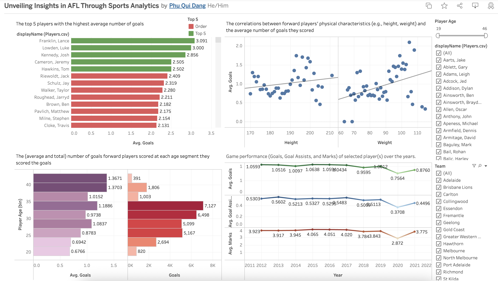

# AFL Player Performance Analysis — Tableau

This project explores the performance of over 600 AFL players across 15 seasons using an interactive Tableau dashboard. The goal was to turn raw Excel data into visual insights that help coaches, analysts, and fans better understand player trends, strengths, and game impact.

---

## What I Did

- Designed a Tableau dashboard to visualize KPIs like average goals, goal assists, marks, and physical characteristics (height, weight)
- Used Excel to clean and prepare raw match data for analysis
- Created age-based segments and comparisons to highlight performance patterns across different stages of players’ careers

---

## Dashboard Preview

**Live Dashboard**:  
[Unveiling Insights in AFL Through Sports Analytics](https://public.tableau.com/app/profile/phu.qui.dang/viz/UnveilingInsightsinAFLThroughSportsAnalytics/DashboardTask2)

---

## Key Takeaways

- Players between 28–30 scored the highest average goals per game  
- Taller and heavier forwards showed slightly stronger scoring performance  
- Some players maintained consistent KPIs over the years, offering insights for recruitment and game planning

---

## Files in This Repo

| File | Description |
|------|-------------|
| `dashboard_preview.png` | A screenshot of the final Tableau dashboard |
| `AFL Sports Analytics Report.docx` | A short write-up summarizing the analysis |
| `README.md` | Project overview |

---

## About Me

Hi, I’m **Phu Qui Dang**, a data analytics student with a strong interest in sports data, business insights, and visualization tools like Tableau and Power BI.  
I enjoy finding trends in messy data and turning them into clear visual stories.

Based in Melbourne | Master of Business Analytics @ La Trobe  
[LinkedIn](https://www.linkedin.com/in/phuquidang/) | [GitHub](https://github.com/dangquii)

---
